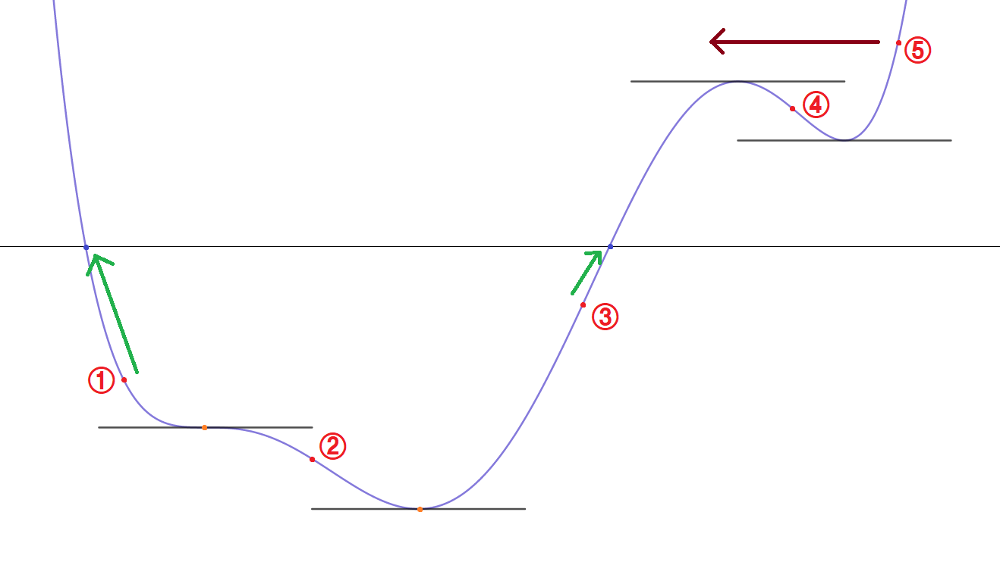

### 계기

고등학교 2학년 때 일반화학 II 과목을 수강하였는데, 산-염기 파트의 적정 실험에 대해 공부하던 중에 적정 그래프에 대해 궁금한 점이 생겼다. 강산-강염기, 강산-약염기, 약산-강염기, 약산-약염기 조합에 따른 그래프의 모양이 제각각이었는데, 여기에 규칙성이 있을까에 대한 의문이었다. 또한 다양성자산인 경우에도 그래프의 모양이 다양하게 나와서 이게 서로 연관이 있는가 또한 궁금했다.

일반화학 수준에서 적정 실험을 기술할 때에는 중화점(또는 당량점)과 반당량점에 대한 정보만 계산할 뿐이다. 좌표평면 위에서의 그래프로서의 적정 곡선에 대한 정보는 가르치지 않았기 때문에 상기한 규칙성에 대해 탐구할 방법이 마땅치 않았다. 하지만 이 파트에는 반당량점과 당량점에서의 pH를 계산할 수 있는 식이 존재했다. 바로 Henderson-Hasselbalch 식과 화학식의 평형식이었다. 이를 사용하면 적정 시 투입한 시약의 약에 따른 pH의 값을 꽤 정확하게 구할 수 있다는 생각이 들었다.

### 1차 (2016.10 ~ 2016.12)

다양성자산은 식을 세우기도 어렵고, 화학평형식으로 이를 구하려면 변수가 여러 개 필요했기 때문에 이 기간에는 1가 산과 1가 염기 사이의 반응만 다루었다.

#### 언어

고등학교 2학년 1학기 때 객체지향프로그래밍 과목을 수강하여 Java에 대한 이론을 어느 정도 공부한 상태였고, 당시 마인크래프트를 즐겨하고 간단한 플러그인도 개발할 수 있었다. 또한 아주 간단한 게임을 개발하기 위해 Java의 GUI 라이브러리인 **Swing**에 대해서도 일부 찾아보고 있는 상태였다. 그래서 **Java**를 사용하여 개발하기로 했다.

#### 이론

##### 산성 용액을 염기성 용액으로 적정할 때의 pH

산성 물질에 대한 Henderson-Hasselbalch 식은 아래와 같다.

$$
pH=pK_a+\log{\frac{\left[A^-\right]}{\left[HA\right]}}
$$

이제 산 HA에 염기 BOH를 첨가하여 적정하는 상황을 가정한다. 그러면 화학식은 아래와 같이 쓸 수 있다.

$$
HA+BOH\rightarrow H_2O+A^-+B^+,K=\frac{\left[A^-\right]}{\left[HA\right]}\frac{\left[B^+\right]}{\left[BOH\right]}=\frac{K_aK_b}{K_w}
$$

산 HA는 농도 Ma에 VamL, 염기 BOH는 농도 Mb에 VbmL가 존재한다고 생각하면 이를 섞었을 때 농도값을 보정해야 한다. 산은 $M'_a=M_a\times\frac{V_a}{V_a+V_b}$, 염기는 $M'_b=M_b\times\frac{V_b}{V_a+V_b}$의 농도를 가지게 된다. 이제 이 농도를 이용하여 반응의 정도를 계산한다. 반응한 단위부피 당 HA의 몰 수를 $x$로 놓으면 아래와 같이 식을 쓸 수 있다.

$$
Q=\frac{\left[A^-\right]\left[B^+\right]}{\left[HA\right]\left[BOH\right]}=\frac{x^2}{(M'_a-x)(M'_b-x)}
$$

위의 반응지수 값이 평형상수 값과 같아야 하므로 방정식을 아래와 같이 쓸 수 있다.

$$
Q=\frac{x^2}{(M'_a-x)(M'_b-x)}=K\\
x^2=K(M'_a-x)(M'_b-x)\\
(K-1)x^2-K(M'_a+M'_b)x+KM'_aM'_b=0
$$

위 방정식에서 $x$ 자리에 0과 $M'_a$를 각각 넣어보면 전자는 $KM'_aM'_b$로 양수, 후자는 $-{M'_a}^{2}$로 음수가 나오므로 반드시 (0, $M'_a$) 사이에 해가 단 하나 존재한다[^1] [^2]. 그 유일한 해 x를 사용하여 pH를 구할 것이다. pH는 위에서 언급한 Henderson-Hasselbalch 식을 사용해서 구한다.

$$
pH=pK_a+\log{\frac{\left[A^-\right]}{\left[HA\right]}}=pK_a+\log{\frac{x}{M'_a-x}}
$$

##### 염기성 용액을 산성 용액으로 적정할 때의 pH

이 경우는 위의 경우를 조금 변형시키면 같은 방식으로 계산이 가능하다. 이것은 pOH의 개념을 도입하면 쉽게 설명이 가능하다.

$$
pOH=-\log{\left[OH^-\right]}\\
\begin{aligned}
pH+pOH&=-(\log{\left[H^+\right]}+\log{\left[OH^-\right]})\\
&=-\log{\left[H^+\right]\left[OH^-\right]}\\
&=-\log{K_w}\\
&=pK_w\simeq14(298K)
\end{aligned}
$$

이제 위와 마찬가지로 구하되, 염기성 용액에 대한 Henderson-Hasselbalch 식을 사용하고, pH 대신 pOH를 구한 후 이 값을 14에서 빼주면 pH를 구할 수 있다. 식으로 표현하면 아래와 같다.

$$
pOH=pK_b+\log{\frac{\left[B^+\right]}{\left[BOH\right]}}=pK_b+\log{\frac{y}{M'_b-y}}\\
pH=14-pOH=14-(-\log_{10}{y})
$$

#### 개발

##### pH를 그래프로 옮기기

적정 그래프는 보통 x축이 넣은 적정 시약의 양, y축이 pH인 좌표평면 위에 그린다. 이를 위해 그림판(!)을 사용하여 그럴듯한 좌표평면을 만들었다. 당시 사용한 좌표평면은 아래와 같다.

각 그리드는 50×40 픽셀 크기를 가지고 있으며, 좌표평면의 총 크기는 1000×560 픽셀이다. 그리고 x축의 끝은 당량점의 2배가 되는 지점을 잡았다. 어차피 이미지는 픽셀로 렌더링되기에 계산하기 편하게 하자는 생각에 이렇게 만들었다. 즉, 넣은 부피는 당량점에 해당하는 부피의 1/500 단위로 하여 각 부피마다 구한 pH를 0.025단위로 반올림하여 y좌표를 정한 후 해당 픽셀에 점을 찍으면 자연스럽게 그래프처럼 보일 것이라 예상하여 그 방법을 택했다.

> **내용 추가 예정**[^3]

### 2차 (2017.03 ~ 2017.06)

고등학교 3학년에 올라와서 졸업논문을 쓸 시기가 되어 이것저것 연구 주제를 찾아보던 중 이것을 조금 더 발전시킨 후 논문으로 쓰면 좋겠다는 생각이 들었다. 그래서 단양성자산만을 계산하는 이 프로그램에서 다양성자산(황산, 인산 등)에 대한 부분까지 지원하기로 했다. 앞의 1차 개발에서 다양성자산의 경우 변수가 여러 개라 방정식을 세우기 힘든 점을 돌파하는 것이 목표가 되었다.

#### 다양한 산에 대한 pH 도출

##### 적정에 대한 분석화학적 접근

앞의 1차 개발에서는 적정 반응에 대하여 화학평형식만으로 계산을 진행했는데, 다양성자산에 대해서는 쉽게 구할 수 없었다. 그래서 이 반응에 대해 다르게 접근하는 방법이 있는지에 대하여 구글링을 해보다가 분석화학(Analytical Chemistry)의 관점으로 접근하는 방법이 존재했다. 그래서 학교 도서관에서 단 두 권 존재하는 분석화학 책을 찾아 관련 식을 이것저것 찾아보았다(어떤 책이었는지는 기억이 나지 않는다). 그 내용은 아래와 같다.

1. 관련된 반응식을 모두 적는다.
1. 양전하의 전하 양과 음전하의 전하 양이 같은지 비교한다(전하 균형을 맞춘다).
1. 특정 원소에 대하여 반응 전의 양과 반응 후의 양을 맞춘다(질량 균형을 맞춘다).
1. 각 반응의 평형 상수를 적고 이를 푼다.

이 방식을 사용하여 식을 세우고 이를 방정식으로 만들면 다양성자산에 대해서도 원하는 값을 어렵지 않게 얻을 수 있을 것이라 생각했다. 그 때 풀었던 내용은 아래와 같다.

###### 1가 산-1가 염기

먼저 반응식을 적어보면 아래와 같다.

$$
HA\rightarrow H^++A^-\\
B+H_2O\rightarrow BH^++OH^-\\
H^++OH^-\rightarrow H_2O
$$

반응식에 연관된 이온들을 모두 찾은 후 전하의 균형을 맞추고 A와 B에 대하여 질량 균형을 맞춰보면 아래와 같다.

$$
\left[H^+\right]+\left[BH^+\right]\left=[A^-\right]+\left[OH^-\right]\\
\left[HA\right]_0=\left[HA\right]+\left[A^-\right]\\
\left[B\right]_0=\left[B\right]+\left[BH^+\right]
$$

그리고 위에서 적은 반응식에 대하여 평형 상수를 구해보면 아래와 같다.

$$
K_1=K_a=\frac{\left[H^+\right]\left[A^-\right]}{\left[HA\right]}\\
K_2=K_b=\frac{\left[BH^+\right]\left[OH^-\right]}{\left[B\right]}\\
K_3=K_w
$$

이 상태로 식을 정리하면 매우 복잡하고 길기 때문에 복잡한 기호를 다른 기호로 치환한다. 여기서 V는 적정하려는 시약의 부피, v는 첨가한 표준 용액의 부피이다.

$$
\begin{aligned}
K_a&\rightarrow&a\\
K_b&\rightarrow&b\\
K_w&\rightarrow&w\\
\left[HA\right]_0\cdot\frac{V}{V+v}&\rightarrow&A\\
\left[B\right]_0\cdot\frac{v}{V+v}&\rightarrow&B\\
\left[H^+\right]&\rightarrow&x\\
\left[OH^-\right]&\rightarrow&y&=w/x
\end{aligned}
$$

$b'=\frac{w}{b}$[^4]로 잡은 후 위 식을 정리하여 $x$에 대한 방정식을 세우면 아래와 같이 된다. 자세한 과정은 [여기](./equation/#s-1.1)를 참고하면 된다.

$$
x^4+(a+B+b')x^3+(ab'+aB-Aa-w)x^2\\
-(Aab'+aw+wb')x-awb'=0
$$

###### 2가 산-1가 염기

반응식은 아래와 같다.

$$
H_2A\rightarrow H^++HA^-\\
HA^-\rightarrow H^++A^{2-}\\
B+H_2O\rightarrow BH^++OH^-\\
H^++OH^-\rightarrow H_2O
$$

전하 균형과 질량 균형을 맞춰보면 아래와 같다.

$$
\left[H^+\right]+\left[BH^+\right]=\left[HA^-\right]+2\left[A^{2-}\right]+\left[OH^-\right]\\
\left[H_2A\right]_0=\left[H_2A\right]+\left[HA^-\right]+\left[A^{2-}\right]\\
\left[B\right]_0=\left[B\right]+\left[BH^+\right]
$$

각 반응식에 대한 평형 상수는 아래와 같다.

$$
K_1=K_{a1}=\frac{\left[H^+\right]\left[HA^-\right]}{\left[H_2A\right]}\\
K_2=K_{a2}=\frac{\left[H^+\right]\left[A^{2-}\right]}{\left[HA^-\right]}\\
K_3=K_b=\frac{\left[BH^+\right]\left[OH^-\right]}{\left[B\right]}\\
K_4=K_w
$$

1가 산-1가 염기와 마찬가지로 다른 기호로 치환한다. 위와 마찬가지로 V는 적정하려는 시약의 부피, v는 첨가한 표준 용액의 부피이다.

$$
\begin{aligned}
K_{a1}&\rightarrow&a\\
K_{a2}&\rightarrow&a'\\
K_b&\rightarrow&b\\
K_w&\rightarrow&w\\
\left[H_2A\right]_0\cdot\frac{V}{V+v}&\rightarrow&A\\
\left[B\right]_0\cdot\frac{v}{V+v}&\rightarrow&B\\
\left[H^+\right]&\rightarrow&x\\
\left[OH^-\right]&\rightarrow&y&=w/x
\end{aligned}
$$

$b'=\frac{w}{b}$[^4]로 잡은 후 위 식을 정리하여 $x$에 대한 방정식을 세우면 아래와 같이 된다. 자세한 과정은 [여기](./equation/#s-1.2)를 참고하면 된다.

$$
x^5+(a+B+b')x^4+(aa'+ab'+aB-Aa-w)x^3\\
+(aa'b'+aa'B-Aab'-aw-wb'-2aa'A)x^2\\
-(awb'+aa'w+2aa'Ab')x-aa'wb'=0
$$

###### 3가 산-1가 염기

반응식은 아래와 같다.

$$
H_3A\rightarrow H^++H_2A^-\\
H_2A^-\rightarrow H^++HA^{2-}\\
HA^{2-}\rightarrow H^++A^{3-}\\
B+H_2O\rightarrow BH^++OH^-\\
H^++OH^-\rightarrow H_2O
$$

전하 균형과 질량 균형을 맞춰보면 아래와 같다.

$$
\left[H^+\right]+\left[BH^+\right]=\left[H_2A^-\right]+2\left[HA^{2-}\right]+3\left[A^{3-}\right]+\left[OH^-\right]\\
\left[H_3A\right]_0=\left[H_3A\right]+\left[H_2A^-\right]+\left[HA^{2-}\right]+\left[A^{3-}\right]\\
\left[B\right]_0=\left[B\right]+\left[BH^+\right]
$$

각 반응식에 대한 평형 상수는 아래와 같다.

$$
K_1=K_{a1}=\frac{\left[H^+\right]\left[H_2A^-\right]}{\left[H_3A\right]}\\
K_2=K_{a2}=\frac{\left[H^+\right]\left[HA^{2-}\right]}{\left[H_2A^-\right]}\\
K_3=K_{a3}=\frac{\left[H^+\right]\left[A^{3-}\right]}{\left[HA^{2-}\right]}\\
K_4=K_b=\frac{\left[BH^+\right]\left[OH^-\right]}{\left[B\right]}\\
K_5=K_w
$$

편의를 위해 상수를 다른 기호로 치환한다. 위와 마찬가지로 V는 적정하려는 시약의 부피, v는 첨가한 표준 용액의 부피이다.

$$
\begin{aligned}
K_{a1}&\rightarrow&a\\
K_{a2}&\rightarrow&a'\\
K_{a3}&\rightarrow&a''\\
K_b&\rightarrow&b\\
K_w&\rightarrow&w\\
\left[H_3A\right]_0\cdot\frac{V}{V+v}&\rightarrow&A\\
\left[B\right]_0\cdot\frac{v}{V+v}&\rightarrow&B\\
\left[H^+\right]&\rightarrow&x\\
\left[OH^-\right]&\rightarrow&y&=w/x
\end{aligned}
$$

$b'=\frac{w}{b}$[^4]로 잡은 후 위 식을 정리하여 $x$에 대한 방정식을 세우면 아래와 같이 된다. 자세한 과정은 [여기](./equation/#s-1.3)를 참고하면 된다.

$$
x^6+(a+B+b')x^5+(ab'+aB-w-aA)x^4\\
+(aa'b'+aa'a''+aa'B-aw-wb'-aAb'-2aa'A)x^3\\
+(aa'a''b'+aa'a''B-aa'w-awb'-2aa'Ab'-3aa'a''A)x^2\\
-(aa'a''w+aa'wb'+3aa'a''Ab')x-aa'a''wb'=0
$$

##### 고차방정식의 해 구하기

###### 뉴턴의 방법(Newton's Method, Newton-Raphson Method)

실계수 다항방정식은 5차 이상에 대하여 일반해를 구할 수 없다고 알려져있다. 그런데 1차 산-1차 염기 적정 과정을 제외한 나머지 과정은 5차 이상의 방정식을 풀어야 한다. 하지만 그래프를 정확히 그릴 필요는 없고 일정 정확도 이상의 근사해만 알아도 픽셀 단위로는 정확한 그래프를 그릴 수 있다. 이 때 방정식의 해를 근사할 수 있는 방법으로 뉴턴의 방법을 채택했다. 그 과정은 아래와 같다.

$$
x_{n+1}=x_n-\frac{f(x_n)}{f'(x_n)}
$$

이 과정을 반복하여 ${x_n}$이 수렴한다면 그 수렴값을 방정식의 근사해로 잡는 것이다. 다만 이 과정을 시작하는 값에 따라 수렴하지 않을 수 있고, 컴퓨터의 실수 정확도 문제로 예상과 다른 결과가 나올 수 있다. 따라서 시작하는 값을 수렴할 확률이 더욱 높게 잡는 방법에 대해 생각해보았다.

###### 뉴턴의 방법 개량

중간값 정리에 따라 다항함수 f에 대하여 음수인 점과 양수인 점을 잡으면 두 점 사이에 항상 근이 존재한다. 그런데 그 두 점이 하필 도함수 값이 0이고 두 점 사이의 점에서는 부호가 일정하다면 해가 유일하게 존재한다.[^5] 이제 도함수 값이 0이 되는 점을 찾으면 된다. 만약 n차방정식의 해를 구하려고 한다면 (n-1)차방정식의 해를 구한 후 근사법을 사용해서 원래 방정식의 해를 구할 수 있는 것이다. 이를 재귀적으로 시행하다보면 일차방정식의 해를 구하는 과정까지 온다. 1차 함수는 $x=-\frac{b}{a}$를 사용하여 정확한 해를 구할 수 있으므로 결국 n차 방정식의 해를 구할 수 있게 된다. 이 아이디어에서 착안하여 프로그램에 사용한 알고리즘은 아래와 같다.

1. 일차방정식이라면 정확한 해를 반환한다.
1. 주어진 계수를 사용하여 도함수를 구한다.
1. 도함수의 해를 구하는 함수를 호출하여 해를 얻는다.(재귀)
1. 각 해에 대하여 함숫값을 얻는다.
1. 각 해에 대하여 함숫값이 0이라면 해집합에 추가한다.
1. 가장 왼쪽의 해는 1을 뺀 값에서 근사를 시작하고 가장 오른쪽의 해는 1을 더한 값에서 근사를 시작한다.
1. 인접한 해끼리 함숫값을 비교하여 부호가 다르면 두 해의 중간 위치에서 근사를 시작한다.
1. 위의 두 근사 과정에 대하여 범위를 벗어나면 근사를 종료하고, 만약 수렴한 값이 존재하면 해집합에 추가한다.
1. 해집합을 반환한다.

이를 그림으로 표현하면 아래와 같다.

이 방법으로 진행하면 높은 확률로 수렴한 값을 찾을 수 있게 된다. 정량적으로 어느 정도 개선되었는지는 알 수 없으나 이 방법을 채택한 후 프로그램을 실행할 때 무한 루프나 예외가 발생하는 횟수가 눈에 띄게 줄었다.

#### 그래프의 기울기

그래프를 그리고 보니 미적분I 수업 당시 선생님께서 "미분은 그래프의 개형을 판단하기 위한 연산이다"라고 말씀하신 것이 떠올라 이 적정 그래프 또한 기울기를 구할 수 있을까에 대하여 고민하기 시작했다. 앞의 방정식 유도에서 사용한 분석화학 전공 책을 뒤져봤지만 자세한 내용을 얻을 수 없어 구글링을 시도했다. 찾아보다가 StackExchange에서 편미분을 사용하여 할 수 있다는 내용을 보았다. 그래서 아래와 같은 방식으로 식을 유도했다. 방정식을 $f(x,v)=0$꼴로 쓴다면,

$$
f(x,v)=0\\
0=df=\frac{\partial f}{\partial x}dx+\frac{\partial f}{\partial v}dv\\
\frac{dx}{dv}=-\frac{\frac{\partial f}{\partial v}}{\frac{\partial f}{\partial x}}\\
\begin{aligned}
\therefore\frac{d(pH)}{dv}&=\frac{d(-\log{x})}{dv}\\
&=\frac{-\frac{1}{x\ln{10}}dx}{dv}\\
&=-\frac{1}{x\ln{10}}\frac{dx}{dv}\\
&=\frac{1}{x\ln{10}}\frac{\frac{\partial f}{\partial v}}{\frac{\partial f}{\partial x}}
\end{aligned}
$$

의 식으로 그래프의 기울기를 구할 수 있는 것이다. 경우에 따라 이 식을 전개한 식은 [방정식 유도 과정](./equation#s-2)에서 찾아볼 수 있다.

#### 개발 

> **내용 추가 예정**[^3]

---

[^1]: (해가 하나 이상 존재함) 직전 학기에 학습했던 미적분학 I에서 나온 중간값 정리를 사용하면 주어진 범위에서 해가 하나 이상 존재함을 보일 수 있다.
[^2]: (해가 2개 존재할 수 없음) 이차방정식은 실수 전체 범위에서 실근을 최대 2개 가지는데, (0, $M'_a$)에서 해가 하나 이상 존재함을 보였으므로 이 범위에서는 해가 하나이거나 2개이다.
      ① 해당 범위에서 중근을 가진다고 가정하자. 그러면 실수 전체 범위의 x에 대해 $f(x)\le 0$ 또는 $f(x)\ge 0$을 만족한다. 그런데 주어진 범위의 양 끝 값에 대한 함수값의 부호가 다르므로 중근일 수 없다.
      ② 해당 범위에서 서로 다른 두 실근이 존재한다고 가정하자. 그러면 중간값 정리에 의해 두 실근 사이의 어떤 실수 y가 존재하여 $f(0)f(y)<0$, $f(y)f(M'_a)<0$를 만족해야 한다. 그런데 두 식을 곱해보면 $f(0)f(y)^2f(M'_a)>0$을 만족해야 하고, $f(y)^2$는 항상 양수이므로 $f(0)f(M'_a)>0$, 즉, 범위의 양 끝 값에 대한 함수값의 부호가 같아야 한다. 그런데 주어진 범위의 양 끝 값에 대한 함수값의 부호가 다르므로 서로 다른 두 실근을 가질 수 없다.
      따라서 위의 이차방정식은 (0, $M'_a$)의 범위에서 근을 단 하나 가진다.

[^3]: 현재 시점에는 이 프로젝트 때 사용했던 컴퓨터 이후로 2번 바뀐 상태라 그 때 사용하던 파일을 찾는 데에 시간이 좀 걸립니다...
[^4]: 식의 의미 상 B+의 이온화 상수다.
[^5]: 연속함수 f와 폐구간 I에서 양 끝점을 제외한 구간의 모든 점에 대해 도함수 f'의 부호가 일정하다면 그 정의에 따라 I에서 f는 단조롭다. 일반성을 잃지 않고 함수가 증가한다고 가정하면, 그 정의에 따라 I의 임의의 두 점 (a, f(a)), (b, f(b))를 잡았을 때 a>b라면 f(a)>f(b)를 만족한다.
      이제 양 끝점의 함숫값의 부호가 다르다고 가정하자. 함수가 증가한다고 가정했으므로 왼쪽 끝점은 함숫값이 음수, 오른쪽 끝점은 양수가 된다. 이제 I의 두 점 (x, 0)와 (y, 0), x≠y가 존재한다고 가정해보겠다. 일반성을 잃지 않고 x>y라고 가정하겠다. 그러면 f는 증가함수이므로 f(x)>f(y)여야 한다. 그런데 가정에서 f(x)=0=f(y)라고 하였으므로, 모순이 된다. 즉, 함수 f에서 근은 많아야 하나 존재할 수 있다.
