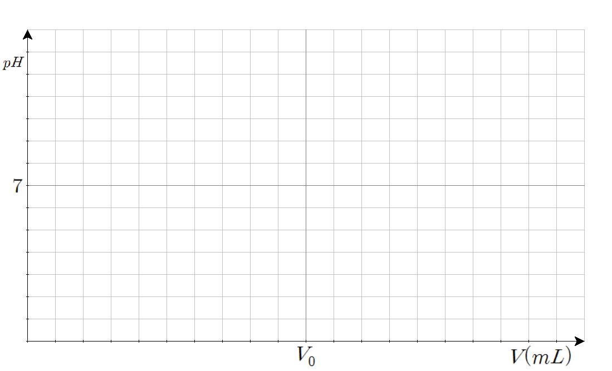

### 계기

고등학교 2학년 때 일반화학 II 과목을 수강하였는데, 산-염기 파트의 적정 실험에 대해 공부하던 중에 적정 그래프에 대해 궁금한 점이 생겼다. 강산-강염기, 강산-약염기, 약산-강염기, 약산-약염기 조합에 따른 그래프의 모양이 제각각이었는데, 여기에 규칙성이 있을까에 대한 의문이었다. 또한 다양성자산인 경우에도 그래프의 모양이 다양하게 나와서 이게 서로 연관이 있는가 또한 궁금했다.

일반화학 수준에서 적정 실험을 기술할 때에는 중화점(또는 당량점)과 반당량점에 대한 정보만 계산할 뿐이다. 좌표평면 위에서의 그래프로서의 적정 곡선에 대한 정보는 가르치지 않았기 때문에 상기한 규칙성에 대해 탐구할 방법이 마땅치 않았다. 하지만 이 파트에는 반당량점과 당량점에서의 pH를 계산할 수 있는 식이 존재했다. 바로 Henderson-Hasselbalch 식과 화학식의 평형식이었다. 이를 사용하면 적정 시 투입한 시약의 약에 따른 pH의 값을 꽤 정확하게 구할 수 있다는 생각이 들었다.

### 1차 개발 (2016.10 ~ 2016.12)

#### 언어

고등학교 2학년 1학기 때 객체지향프로그래밍 과목을 수강하여 Java에 대한 이론을 어느 정도 공부한 상태였고, 당시 마인크래프트를 즐겨하고 간단한 플러그인도 개발할 수 있었다. 또한 아주 간단한 게임을 개발하기 위해 Java의 GUI 라이브러리인 **Swing**에 대해서도 일부 찾아보고 있는 상태였다. 그래서 **Java**를 사용하여 개발하기로 했다.

#### 이론

##### pH의 계산

산성 물질에 대한 Henderson-Hasselbalch 식은 아래와 같다.

$$
pH=pK_a +\log{\frac{[A^-]}{[HA]}}
$$

이제 산 HA에 염기 BOH를 첨가하여 적정하는 상황을 가정한다. 그러면 화학식은 아래와 같이 쓸 수 있다.

$$
HA+BOH\rightarrow H_2O+A^{-}+B^{+},K=\frac{[A^{-}]}{[HA]}\frac{[B^{+}]}{[BOH]}=\frac{K_aK_b}{K_w}
$$

산 HA는 농도 Ma에 VamL, 염기 BOH는 농도 Mb에 VbmL가 존재한다고 생각하면 이를 섞었을 때 농도값을 보정해야 한다. 산은 $M'_a=M_a\times\frac{V_a}{V_a+V_b}$, 염기는 $M'_b=M_b\times\frac{V_b}{V_a+V_b}$의 농도를 가지게 된다. 이제 이 농도를 이용하여 반응의 정도를 계산한다. 반응한 단위부피 당 HA의 몰 수를 $x$로 놓으면 아래와 같이 식을 쓸 수 있다.

$$
Q=\frac{[A^{-}][B^{+}]}{[HA][BOH]}=\frac{x^2}{(M'_a-x)(M'_b-x)}
$$

위의 반응지수 값이 평형상수 값과 같아야 하므로 방정식을 아래와 같이 쓸 수 있다.

$$
Q=\frac{x^2}{(M'_a-x)(M'_b-x)}=K\\
x^2=K(M'_a-x)(M'_b-x)\\
(K-1)x^2-K(M'_a+M'_b)x+KM'_aM'_b=0
$$

위 방정식에서 $x$ 자리에 0과 $M'_a$를 각각 넣어보면 전자는 $KM'_aM'_b$로 양수, 후자는 $-{M'_a}^{2}$로 음수가 나오므로 반드시 (0, $M'_a$) 사이에 해가 단 하나 존재한다[^1] [^2]. 이제 위의 이차방정식의 해를 써보면 아래와 같이 된다.

$$
\begin{aligned}
x&=\frac{K(M'_a+M'_b)\pm\sqrt{K^2(M'_a+M'_b)^2-4(K-1)KM'_aM'_b}}{2(K-1)}\\
&=\frac{K(M'_a+M'_b)\pm\sqrt{K^2(M'_a-M'_b)^2+4KM'_aM'_b}}{2(K-1)}
\end{aligned}
$$

여기서 구한 x를 사용하여 pH를 구할 것이다. pH는 위에서 언급한 Henderson-Hasselbalch 식을 사용해서 구한다.

$$
pH=pK_a+\log{\frac{[A^{-}]}{[HA]}}=pK_a+\log{\frac{x}{M'_a-x}}
$$

##### pH를 그래프로 옮기기

적정 그래프는 보통 x축이 넣은 적정 시약의 양, y축이 pH인 좌표평면 위에 그린다. 이를 위해 그림판(!)을 사용하여 그럴듯한 좌표평면을 만들었다. 당시 사용한 좌표평면은 아래와 같다.

각 그리드는 50×40 픽셀 크기를 가지고 있으며, 좌표평면의 총 크기는 1000×560 픽셀이다. 그리고 x축의 끝은 당량점의 2배가 되는 지점을 잡았다. 어차피 이미지는 픽셀로 렌더링되는거 계산하기 편하게 하자는 생각에 이렇게 만들었다. 즉, 넣은 부피는 당량점에 해당하는 부피의 1/500 단위로 하여 각 부피마다 구한 pH를 0.025단위로 반올림하여 y좌표를 정한 후 해당 픽셀에 점을 찍으면 자연스럽게 그래프처럼 보일 것이라 예상하여 그 방법을 택했다.

> **나머지는 추후 작성 예정**

---

[^1]: (해가 하나 이상 존재함) 직전 학기에 학습했던 미적분학 I에서 나온 중간값 정리를 사용하면 주어진 범위에서 해가 하나 이상 존재함을 보일 수 있다.
[^2]: (해가 2개 존재할 수 없음) 이차방정식은 실수 전체 범위에서 실근을 최대 2개 가지는데, (0, $M'_a$)에서 해가 하나 이상 존재함을 보였으므로 이 범위에서는 해가 하나이거나 2개이다.
      ① 해당 범위에서 중근을 가진다고 가정하자. 그러면 실수 전체 범위의 x에 대해 $f(x)>=0$ 또는 $f(x)<=0$을 만족한다. 그런데 주어진 범위의 양 끝 값에 대한 함수값의 부호가 다르므로 중근일 수 없다.
      ② 해당 범위에서 서로 다른 두 실근이 존재한다고 가정하자. 그러면 중간값 정리에 의해 두 실근 사이의 어떤 실수 y가 존재하여 $f(0)f(y)<0$, $f(y)f(M'_a)<0$를 만족해야 한다. 그런데 두 식을 곱해보면 $f(0)f(y)^2f(M'_a)>0$을 만족해야 하고, $f(y)^2$는 항상 양수이므로 $f(0)f(M'_a)>0$, 즉, 범위의 양 끝 값에 대한 함수값의 부호가 같아야 한다. 그런데 주어진 범위의 양 끝 값에 대한 함수값의 부호가 다르므로 서로 다른 두 실근을 가질 수 없다.
      따라서 위의 이차방정식은 (0, $M'_a$)의 범위에서 근을 단 하나 가진다.
